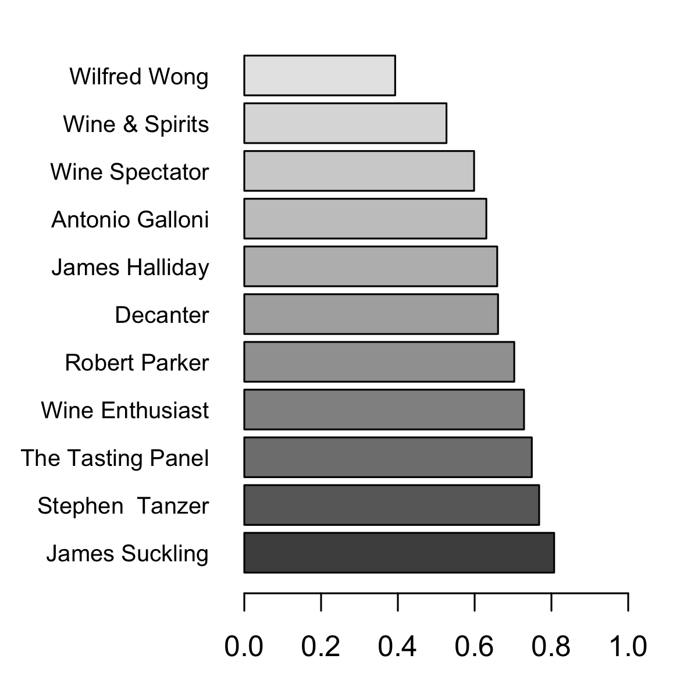

# Vendange
Vendange is a study of the relationship between the price of wine and its ranking.

This project is my first attempt at using R: previously, I did all of my data analysis in Python.
I was pleasantly surprised by R's simplicity and efficacy!

## Why

This script's aim is to determine how wine's perceived quality is linked to its price.
Additionally, this project can aid in comparing different wine critics: it should reveal how much each critic agrees with the market's pricing of wine.

Hopefully, Vendange will also provide some insight into how much of a [Veblen good](https://en.wikipedia.org/wiki/Veblen_good) wine is.

## What It Does

First, Vendange loads a [wine dataset] (http://insightmine.com/bring-your-own-data-analyzing-wine-market/).
Then, after cleaning up the data, the script calculates the correlation between the price of wine bottles and the score attributed to them by each wine critic.
Finally, after eliminating critics who have little variation in the scores they give out, Vendange outputs a bar graph representing its results.

## Results

# What They Mean

On a fundamental level, these results indicate that Wilfred Wong's ratings, for instance, are far less linked to wine's price than James Suckling.
Beyond that, however, it is difficult to draw objective conclusions: some might argue that a high correlation between rating and price is the sign of an efficient market, while others might attribute it to the influence a bottle's price has on a critic's taste.

That being said, however, it can be interesting to note that Robert Parker, the most famous of these wine critics, is *almost* the median value in this list of results.
One might hypothesise that his fame is linked to his ratings' relatively moderate link to the price of wine.
